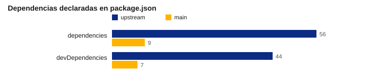
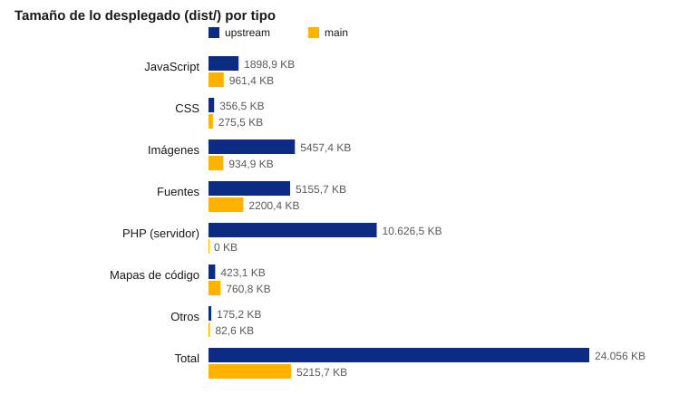
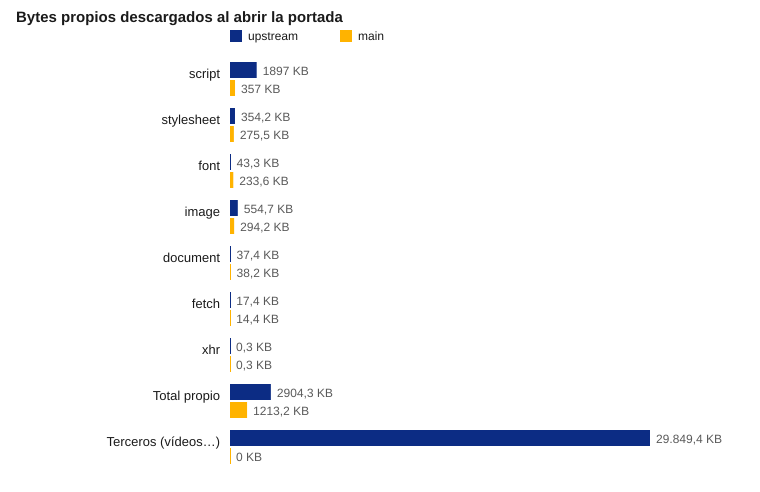
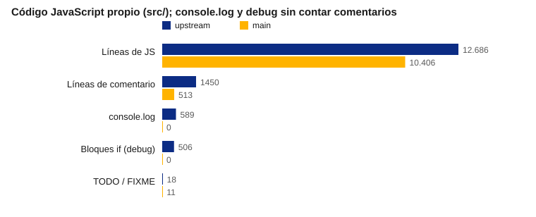
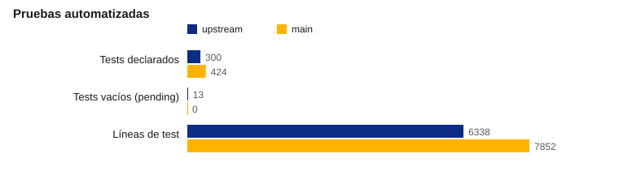

# Informe de modernización de Aritmates

Comparación técnica entre la versión original (rama `upstream`) y la versión mantenida (rama `main`).

| | |
|---|---|
| **Objeto** | Valorar qué ha mejorado, qué ha empeorado y qué queda pendiente tras la simplificación de Aritmates. |
| **Versiones comparadas** | `upstream` (`a78fc91`, código entregado por el proveedor, versión 1.0.5) y `main` (`86c6c48`, versión 1.3). |
| **Fecha de las mediciones** | 26 de septiembre de 2026. |
| **Método** | Script reproducible `scripts/informe-modernizacion.mjs`. Datos en [`docs/informe/metricas.json`](informe/metricas.json). |
| **Elaborado por** | Área de Tecnología Educativa. |

## 1. Objeto

Este informe compara la aplicación original con la actual en cuatro aspectos: tamaño y rendimiento, seguridad,
pruebas y mantenibilidad. Las cifras se han medido sobre el código de cada rama; los juicios se separan de los
datos. El propósito es decidir qué hacer a continuación, no justificar lo hecho, por lo que se señalan también
los defectos de la versión actual.

## 2. Conclusión

**La versión actual es claramente mejor que la original en tamaño, seguridad, pruebas y facilidad de despliegue,
pero el motor que genera los ejercicios sigue siendo esencialmente el heredado y es la principal deuda.**

- Lo desplegado pasa de 24 MB a 3,1 MB y el navegador descarga 1,1 MB propios en lugar de 2,9 MB, además de
  los 30 MB que la versión original pedía a terceros al cargar la portada.
- Desaparecen el servidor PHP, el código de envío de correo, una clave secreta escrita en el código, el uso
  de `eval` y la lectura síncrona de la configuración.
- Se pasa de 100 dependencias declaradas a 15, y de un CI que no ejecutaba las pruebas a uno que bloquea la
  integración si fallan el lint, 429 pruebas unitarias, 14 de extremo a extremo o el umbral de cobertura.
- El motor conserva la estructura de la versión original: clases grandes con estado mutable, reintentos que dependen de
  la secuencia aleatoria y comportamientos incorrectos que no se han corregido para no cambiar los ejercicios
  que ya se generan (apartado 7).

## 3. Resumen de la valoración

| Aspecto | upstream | main | Observaciones |
|---|---|---|---|
| Despliegue | Requiere PHP | Estático | `main` se publica en cualquier servidor web o en GitHub Pages. |
| Tamaño desplegado | 24 MB, 628 ficheros | 3,1 MB, 75 ficheros | −87 %. 10,6 MB de la original eran librerías PHP. |
| Descarga de la portada | 2,9 MB propios + 30 MB de terceros | 1,1 MB propios | Los vídeos incrustados de la ayuda se sustituyeron por enlaces. |
| Dependencias | 56 + 44 | 8 + 7 | La original declaraba React y Material UI sin importarlos. |
| Seguridad | Clave en el código, `eval`, backend PHP | Sin backend ni `eval` | La configuración se lee sin peticiones síncronas. |
| Pruebas | 300 declaradas, 13 vacías, sin CI | 429 unitarias + 14 E2E en CI | La original no se podía ejecutar sin webpack y Selenium. |
| Código de depuración | 589 `console.log`, 506 bloques `debug` | 0 y 0 | Contando solo código ejecutable. |
| Motor de ejercicios | 2962 líneas en una clase | 1423 en la misma clase | Mejor, pero no rediseñado. |
| Interfaz | Polymer, MDC, xy-ui, React sin uso | Elementos propios y jQuery | Formulario duplicado para escritorio y móvil en ambas. |
| Licencia | `UNLICENSED` | AGPL-3.0 | Condición necesaria para publicar el código. |

: Tabla 1. Resumen de la comparación.

## 4. Cifras

Dos cifras no mejoran y conviene explicarlas:

- **Las líneas de JavaScript propio solo bajan un 18 %** (de 12 686 a 10 406). La versión original delegaba la
  interfaz en librerías de npm (Polymer, xy-ui, MDC) que no cuentan como código propio; la actual las sustituye
  por elementos propios y añade módulos puros y probados. El código muerto y el de depuración sí han
  desaparecido, pero el volumen del motor sigue siendo alto.
- **Las fuentes descargadas al abrir la portada siguen por encima de la original** (110 KB frente a 43 KB). La
  original no cargaba Roboto y mostraba la fuente del sistema; la actual carga un subconjunto latino de Roboto
  en tres pesos con `font-display: swap`, de modo que el texto no espera a la fuente.

## 5. Mejoras aplicadas

### Despliegue y rendimiento

- Aplicación estática: sin PHP, sin Composer y sin servidor de aplicación. `npm run build` genera `dist/`.
- Webpack y Babel sustituidos por esbuild y Sass: un build de menos de un segundo sin configuración propia.
- jsPDF y html2canvas solo se descargan al imprimir; la portada no espera a imágenes ni librerías.
- Retirados 95 ficheros de imagen y fuente que nada referenciaba (entre ellos 12 TTF), copias de librerías que nadie cargaba,
  Font Awesome (se usaba para tres iconos) y dos hojas de estilo de MDC.
- Roboto en subconjunto latino, solo con los tres pesos que se usan y `font-display: swap`: la portada
  descarga 110 KB de fuentes en lugar de 234 KB y `dist/fonts` pasa de 2,2 MB a 110 KB.
- `config.json` se lee con `fetch` antes de arrancar la aplicación, sin petición síncrona, y se sigue pudiendo
  editar en `dist/` después de construir.

### Seguridad

- Eliminado el backend PHP (`send.php` para el correo, cuya llamada ya estaba comentada, y `pdf.php` con
  dompdf) y la clave con la que `index.php` generaba un hash diario para cada página, escrita en el repositorio.
- `eval` sustituido por un analizador aritmético propio (`evaluateArithmetic`) que rechaza cualquier entrada que
  no sea una operación, probado con casos como `alert(1)`.
- Workflows con permisos mínimos, auditoría de dependencias en el CI y subida de cobertura a Codecov por OIDC,
  sin secretos.

### Calidad del código

- Retirados 414 bloques de depuración, unas 600 líneas de código comentado y casi 50 métodos sin llamadas,
  verificados comparando por AST el conjunto de métodos antes y después.
- Reglas puras extraídas del motor (aritmética, expresiones, reglas numéricas, aleatoriedad) y lógica de la
  interfaz extraída de `app.js` (temporizador, sesión, resultados, disponibilidad de opciones).
- Retirado el flag `debug` y el enganche de las antiguas pruebas con Selenium: el motor ya no tiene ramas que
  solo existan para depurar.
- `no-unused-vars` bloqueante en todo el repositorio.

### Pruebas e integración continua

- Suite única de Mocha (429 pruebas) sin pruebas vacías, con semilla inyectable para que los ejercicios sean
  reproducibles, y un *golden master* que fija la salida del motor para 1184 combinaciones de opciones y semillas.
- 14 pruebas de extremo a extremo con Playwright: flujo completo, vista previa del PDF, accesibilidad, ayuda,
  diálogos y carga de la configuración, que además fallan si la página lanza un error.
- Umbral de cobertura del 98 % en líneas sobre los módulos saneados. El umbral anterior no medía nada (daba un
  100 % falso) y se corrigió.
- El despliegue en GitHub Pages solo ocurre tras un CI correcto en `main`.

### Defectos corregidos

| Defecto | Origen | PR |
|---|---|---|
| Las sumas con «resultado igual a» eran falsas (`12 + (-18) = 30`) | Original | #127 |
| El reintento de paréntesis podía colgar la página | Original | #141 |
| En el navegador no se detectaban los `Decimal`, a diferencia de los tests | Original | #140 |
| Se marcaba «resultado no es entero» cuando sí lo era | Original | #146 |
| Los diálogos acumulaban acciones y «Atrás» no cerraba | Original | #137 |
| Un cero explícito se trataba como «sin operando» | Original | #120, #121 |
| `debug` alteraba los ejercicios generados | Original | #114 |
| Una división entera con operandos inexactos se daba por buena (`7 / 2 = 3`) | Original | #151 |
| Añadir una operación ya seleccionada lanzaba un error | Original | #153 |
| Fallaba el ZIP del release | Pipeline del proyecto | #134 |

: Tabla 2. Defectos corregidos durante la modernización.

## 6. Valoración crítica de la versión original

- **Arquitectura innecesariamente pesada para lo que hace.** Una aplicación de ejercicios que funciona en el
  navegador dependía de PHP, Composer, webpack con cinco configuraciones y Babel, y declaraba 100 dependencias,
  entre ellas React y Material UI sin usarlas.
- **Seguridad descuidada.** La clave con la que se generaba el hash de cada página estaba en el código, se
  evaluaban expresiones con `eval` y seguía desplegado un script PHP de envío de correo que ya no se usaba.
- **Código de depuración mezclado con el de producción.** 589 `console.log` y 506 bloques `if (debug)`, con
  efectos sobre los ejercicios cuando `debug` estaba activo, y 1450 líneas de comentario, gran parte código
  desactivado.
- **Pruebas que no protegían nada.** Había 300 pruebas, pero 13 estaban vacías, solo se ejecutaban
  empaquetándolas con webpack y el CI se limitaba al análisis SAST de GitLab: nadie sabía si pasaban.
- **Defectos visibles para el alumnado**, como las sumas falsas con «resultado igual a», presentes en la
  versión entregada.
- **Sin licencia** (`UNLICENSED`), lo que impedía reutilizar o publicar el código.

Justo es reconocer que la lógica pedagógica (niveles, tipos de número, incógnita en distintas posiciones,
enfoque, múltiplos) es rica y está pensada para el aula. La modernización la ha conservado íntegramente.

## 7. Valoración crítica de la versión actual

- **El motor no se ha rediseñado.** `OperacionMultiple.js` (1423 líneas) y `operacion.js` (1183) siguen
  basándose en clases con estado mutable, en reintentos y en efectos laterales difíciles de razonar. Se ha
  preferido fijar el comportamiento antes que mejorarlo, lo que protege a los usuarios pero perpetúa rarezas:
  - una división entera con operandos dados que no dividen exacto (o con múltiplos de 10) se sigue mostrando
    truncada, como `7 / 2 = 3`. Desde #151 queda registrada como error, pero el resultado no se corrige. En
    15 000 ejercicios generados por exámenes no apareció ninguna igualdad falsa;
  - dos generadores crean unas 20 operaciones descartadas por ejercicio, y cortarlas cambia qué ejercicios
    se generan (se probó y se descartó).
- **`app.js` sigue siendo un fichero de 1526 líneas** con estado global y jQuery. Se han extraído piezas, pero
  el cableado de la interfaz, incluido el formulario duplicado para escritorio y móvil, continúa ahí.
- **Algunos elementos de interfaz son copias de terceros** (el control deslizante y sus etiquetas, 734 líneas)
  con poca cobertura unitaria; solo los protegen las pruebas de extremo a extremo.
- **El volumen de cambios ha sido muy alto** (138 PRs fusionados), buena parte en pocos días y con ayuda
  de agentes de IA. Cada PR es pequeño y va validado, pero la revisión humana de semejante volumen es limitada.
- **Las pruebas son amplias pero con límites:** el *golden master* ocupa unos 525 KB, el E2E solo usa Chromium
  y no hay auditoría automatizada de accesibilidad o rendimiento más allá de comprobaciones concretas.

## 8. DAFO de la versión actual

| | Positivo | Negativo |
|---|---|---|
| **Interno** | **Fortalezas.** Estática y ligera (1,1 MB en la portada). Sin backend ni secretos. CI bloqueante con 429 + 14 pruebas y golden master. Licencia AGPL y documentación en español. | **Debilidades.** Motor heredado con estado mutable y rarezas fijadas a propósito. `app.js` de 1526 líneas con jQuery. Formulario duplicado. Elementos de interfaz copiados de terceros. E2E solo en Chromium. |
| **Externo** | **Oportunidades.** El golden master permite corregir el motor de forma controlada. Podría ofrecerse como aplicación instalable sin conexión. Reutilizable por otras comunidades gracias a la licencia. | **Amenazas.** Dependencia de jQuery y Bootstrap a largo plazo. Riesgo de que el volumen de cambios asistidos por IA supere la capacidad de revisión. Conocimiento del motor concentrado en pocas personas. Cambios en Medusa Mediateca pueden romper los enlaces a los vídeos. |

: Tabla 3. DAFO de la versión mantenida.

## 9. Propuestas

1. Corregir el motor en PRs pequeños, revisando a mano el cambio del golden master de cada uno; empezar por
   que una división con operandos inexactos se regenere en lugar de mostrarse truncada.
2. Unificar el formulario de escritorio y móvil en uno responsive, revisando las pruebas E2E.
3. Ejecutar las pruebas de extremo a extremo también en Firefox y WebKit.
4. Añadir una auditoría automatizada de accesibilidad y rendimiento (Lighthouse o axe) al CI, sin bloquear al
   principio.
5. Limitar el ritmo de PRs para que la revisión humana siga siendo real.

<!-- salto de página -->

## Anexo A. Metodología

- **Código fuente.** Leído de git en cada rama (`git ls-tree`, `git show`). Se cuentan los `.js` de `src/`
  fuera de carpetas `vendor/`; `console.log`, `eval` y `if (debug)` solo en líneas que no son comentario.
- **Despliegue.** `dist/` de `upstream` está versionado en la rama; el de `main` se construye con
  `npm run build`. Se clasifica por extensión; el PHP de `vendor/` cuenta como servidor.
- **Carga.** Cada `dist/` se sirve con `scripts/serve.mjs` en local y sin compresión; Playwright abre la portada
  cinco veces con caché vacía y se toma la mediana de los tiempos. Para `upstream`, el HTML se reconstruye como
  lo compondría `index.php`, sin el hash de la clave. Los bytes de otros orígenes se cuentan aparte; varían
  algo entre ejecuciones porque dependen de YouTube.
- **Límites.** Los tiempos locales no representan una red real y solo sirven para comparar. Las pruebas de
  `upstream` no se ejecutaron (requieren su configuración de webpack y Selenium); se cuentan las declaradas.
  No se ha medido con Lighthouse.
- **Reproducir.** `node scripts/informe-modernizacion.mjs` regenera `docs/informe/`. El PDF se genera con la
  plantilla de documentos del ATE a partir de este fichero.

## Anexo B. Métricas completas

| Métrica | upstream | main |
|---|---:|---:|
| Dependencias / devDependencies | 56 / 44 | 8 / 7 |
| Ficheros JS propios / líneas | 31 / 12 686 | 49 / 10 406 |
| Fichero más grande (líneas) | `OperacionMultiple.js` (2962) | `app.js` (1526) |
| `console.log` / bloques `debug` ejecutables | 589 / 506 | 0 / 0 |
| `eval` | 1 | 0 |
| Líneas de comentario | 1450 | 513 |
| PHP (ficheros / líneas) | 3 / 778 | 0 / 0 |
| Pruebas declaradas (unitarias y E2E) / vacías | 300 / 13 | 424 / 0 (410 unitarias y 14 E2E) |
| Configuraciones de build (webpack, Babel) | 6 | 0 |
| Tamaño de `dist/` | 24 056 KB (628 ficheros) | 3131 KB (75 ficheros) |
| Recursos de cliente (sin PHP ni mapas) | 13 006 KB | 2363 KB |
| Portada: bytes propios / peticiones | 2904 KB / 45 | 1088 KB / 47 |
| Portada: bytes de terceros / peticiones | 30 041 KB / 93 | 0 / 0 |
| Portada: evento `load` (mediana local) | 1417 ms | 33 ms |

: Tabla 4. Métricas medidas el 26 de septiembre de 2026.
