<!-- 
# **Reunion cierre Aritmates** 
backgroundColor: black 
#_backgroundColor: white
_color: white
#_class: big
#style: 'font-size: 200%'
-->
<style>
section.lead h1 {
  font-size: 290%;
  bottom: 5%;
  left: 3%;
  position: absolute;
}
.big{
    font-size: 300px;
    background: red;
}
</style>


#  Aritmates 

---
<!-- 
backgroundImage: none;
backgroundColor: #fffff3;
color: black;
#class: big;
-->

# ARTIMATES

Es una aplicación web cuyo objetivo es realizar ejercicios con operaciones matemáticas

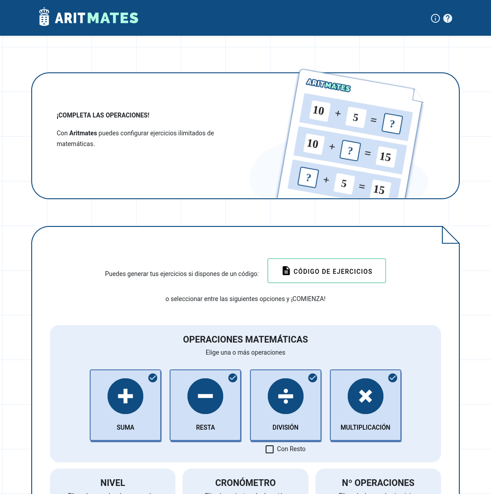


---
<!-- 
backgroundImage: none;
#backgroundColor: white;
color: black;
#class: big;
-->

- Explicación general de estructura de la aplicación
- Información en GitLab:
  - Código, documentación, archivos md,
    guía del desarrollador


<!-- (libreria en guia des) -->
---

# Estructura de la aplicación
<!-- 
Principal mente se usa Javascript
Comentar que se usa Webpack para generar el codigo 
-->
- JavaScript ( ES6 )
- PHP ( solo para generar PDF ejercicio )


---

<!-- 
backgroundColor: #ebe9d8;
-->

<style scoped>
img{
  position: absolute;
  right: 3rem;
  top: -30px;
  height: 200%;
}
p{
  text-align: left;
  margin-left: 1rem;
  font-size: 2.5rem;
}
ul{
  margin-left: 2rem;
}
li{
  font-size: 1rem;
}
</style>

<!-- 
Comento algunos archivos principales
Aparte de estos hay mas partes del codigo que puedo comentar de pasada
como generarExamen.js
ImprimirPdf.js
OptionsShortcode.js
-->

Archivos
- App.js
- Clases Operaciones
- Widgets
- Templates


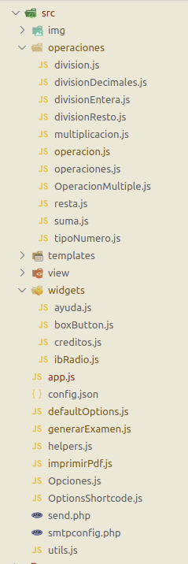

---

<!-- 
#_backgroundColor: #ddd; 
-->

<!-- 
Desde app.js se incuye todo el resto del codigo , fuentes, css, que luego
se empaqueta con webpack
-->

**app.js** Carga la aplicación y ejecuta la lógica principal

```js
import $ from 'jquery';
import '@polymer/paper-item/paper-item.js';
import '@polymer/paper-listbox/paper-listbox.js';
import '@polymer/paper-checkbox/paper-checkbox.js';
import '../css/main.scss';
import '../css/widgets.css';
import '../css/ejercicio.scss';
import '../css/resultado.scss';
import '../css/print.scss';
import {DEFAULTS, ENABLE} from './defaultOptions';
import OPERACIONES from './operaciones/operaciones';
import {TIPO_NUMERO} from './operaciones/tipoNumero';
import './widgets/creditos';
import ayudaDrawer from './widgets/ayuda';
import GenerarExamen from './generarExamen';
import OptionsShortcode from './OptionsShortcode';
```

---

<!-- 

En usa generarExamen para generar una serie de operaciones con las 
opciones que se dan y pasa a las disitntas partes como ver los ejercicios
o los resultados 


```php
const enviarRespuesta = (ev) => {
  
  endPregunta = Date.now();
  tiempoPreguntas[currentOp] = endPregunta - startPregunta;
  score.tiempoConsumido += tiempoPreguntas[currentOp];
  startPregunta = Date.now();
  score.tiempoMedioEjercicio = score
      .tiempoConsumido / opcionesGuardadas.cantidadOperaciones;
  const op = examen.operacionesExamen[currentOp];
  let respuesta = $('.incognita')[0].value;

  if ( (respuesta == '' || !op.esRespuesta(respuesta)) &&
      puedeReintentar ) {
    $('.pantalla').hide();
    $('.modalEjercicio.reintentar').addClass('d-flex');
    puedeReintentar = false;
    return;
  }
```
---
-->

<!-- Comentar -->

Todas las operaciones se basan en la clase *Operacion*

<!--
contienen los métodos ara generar 
 un tipo de operacion especifico, 
comprobar el resultado
y generar esta como texto o el html base (sin estilo)

-->

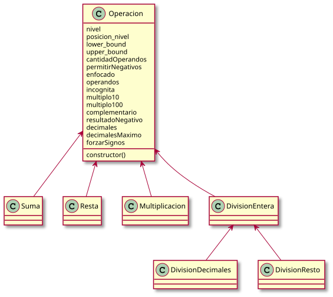

---

<!--
Muestra cabecera de clase resta :
-->

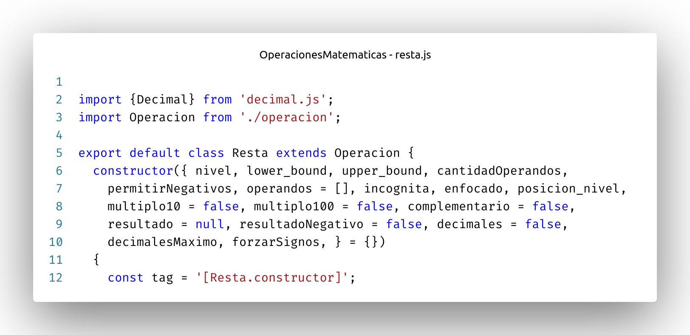

---

<!-- ejemplo de uso, 
comentar que esto lo hace la app llamando a la clase 
generar examen 
-->

resta = New resta(opciones);
resta.toString();

10 - 4 = [6]

&nbsp;
--- 


---
<style scoped>
img{
  margin-left: 0.5rem;
  margin-right: 0.5rem;
  margin-bottom: 40px;
}

</style>

<!-- 
Muchos de los controles, botones, selectores que vemos son de las liberia @polymer
para controles estioo material desing pero algunos se tubieron que crear y estan contenidos
en estos archivos
-->

# widgets 

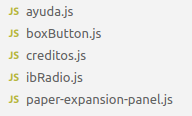
 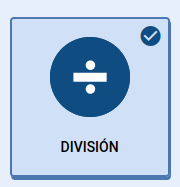  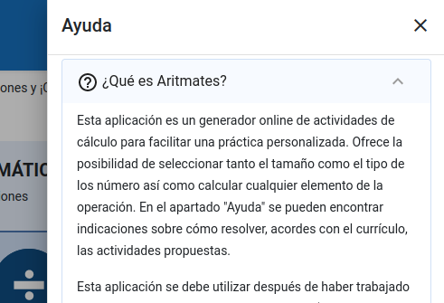 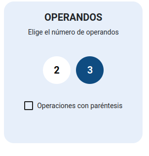 

---
<!-- templates -->

# Templates

<!-- E l codigo refleja como se carga el temlpate -->
Fácilmente editables por separado se cargan con fetch en la aplicación

```js
fetch('./templates/part_ejercicio.html')
  .then((response) => response.text() )
  .then((data) => {
        $('#hoja-opciones').attr('id', 'ejercicios');
        $('#newContent').hide();
        $('#newContent').append(data);
        ...
```

---

<!-- Ejemplo teplate en accion -->

#### part_ejercicio.html


      <div class="cara col-md-3">
        
      </div>

      <div class="title col-12">
        Lo siento, Respuesta Incorrecta
      </div>
      <p class="description col-12">
        Prueba de nuevo con otro intento.
      </p>

      <div class="py-3">
          Entendido
      </div>

 
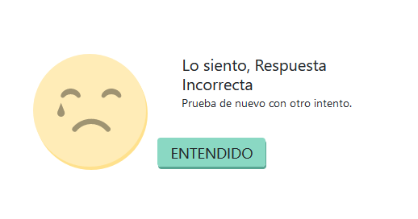

---

# Librerías
(entre otras)
<!--  -->

- Widget Material Design
- Decimal.js
- jsPDF

---

<!-- 
decimal.js es la An arbitrary-precision Decimal type for JavaScript.  permite hacer operaciones con decimales sin problemas
-->

# Decimal.js

Soluciona problemas con decimales y números grandes
```js
0.3 - 0.1             // 0.19999999999999998
x = new Decimal(0.3)
x.minus(0.1)          // '0.2'
```

---

# jsPDF

<!--
 Al cambiar la estructura del PDF que se va a generar pueden aparecer paginas en blanco o descolocar el contenido 
 ImprimirPdf.js
 templates/plantillaPdf.html
 -->

 Generar PDF con JavaScript

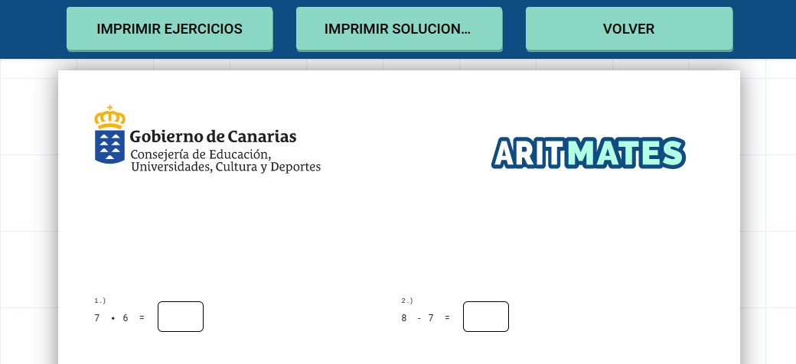

---

# Documentación

La documentación está en la raíz y en **docs/** (`README.md`, `docs/SIMPLIFICACION.md`, etc.).

---


## Archivos markdown

Readme: Información para la instalación de cero.

Developers: Para montar el entorno de desarrollo.

Changelog: Cambios entre versiones.

---

### Readme.md


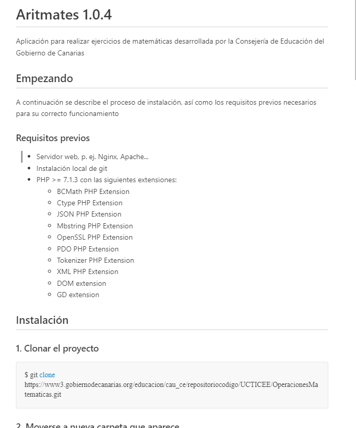


---

### Developers.md
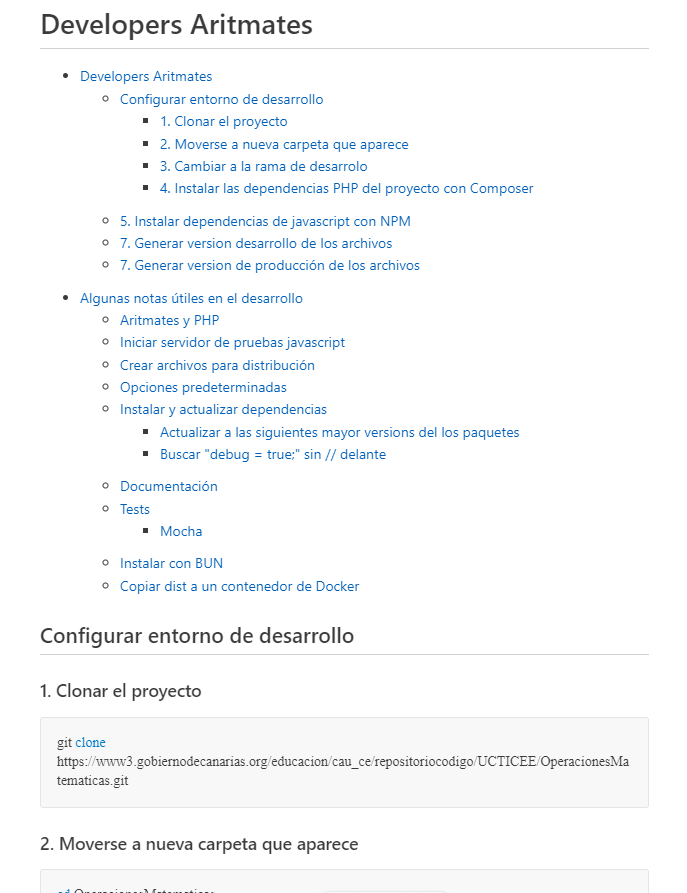


---

### Version.md
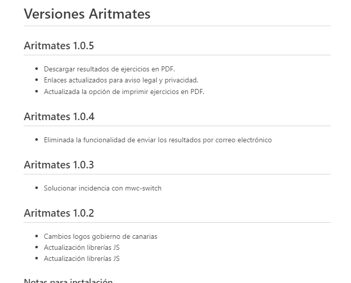


<!-- ```
## Instalación
### 1.  Clonar el proyecto

$ git clone https://www3.g...

### 2.  Moverse a nueva carpeta que aparece

$ cd OperacionesMatematicas

``` -->

---

# Guía del desarrollador

--- 
<!-- <style scoped>
img {
  position: absolute;
  top: -70px;
  left: 2.5rem;
  width: 80%;
}
</style> -->

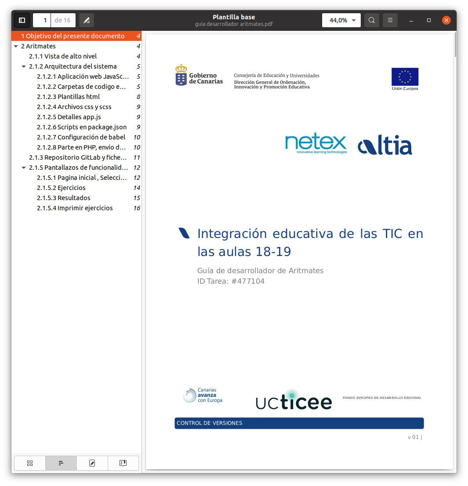

--- 
<!-- 
<style scoped>
img {
  position: absolute;
  top: -70px;
  left: 2.5rem;
  width: 80%;
}
</style> -->


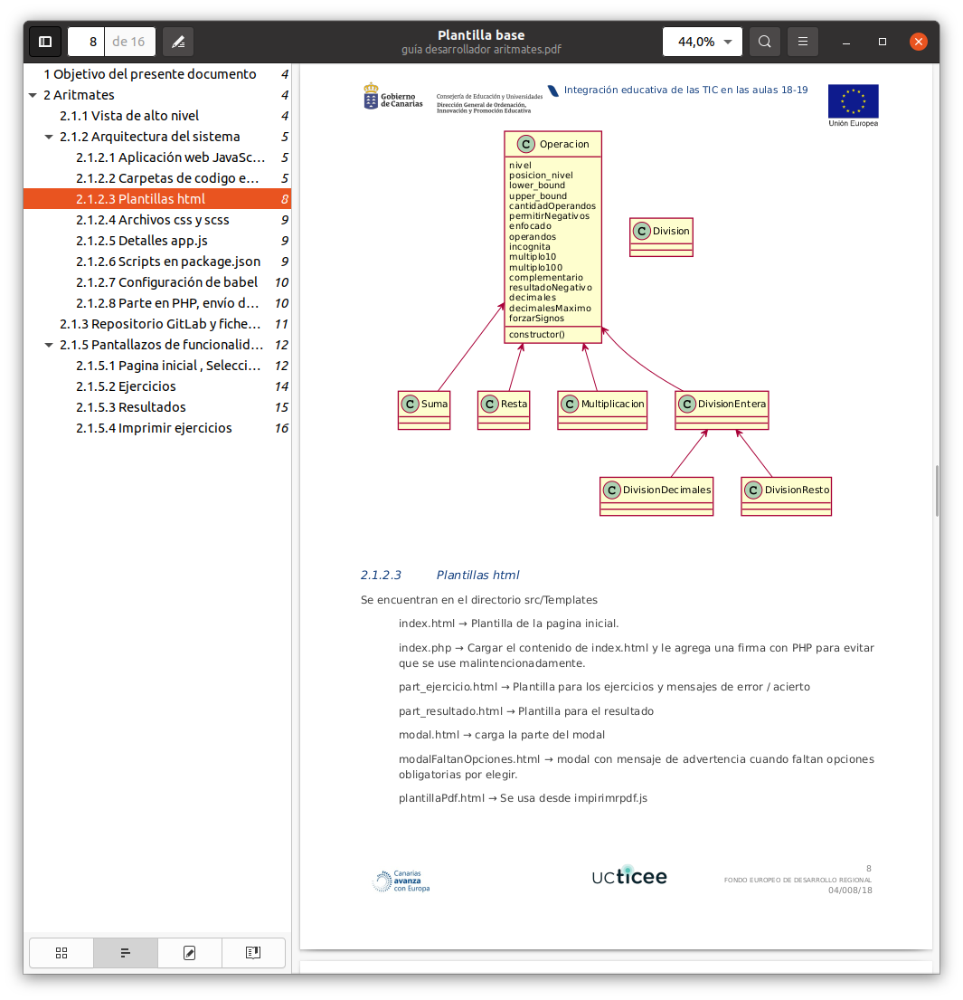

--- 
### Versión para despliegue


```Shell
   npm run build
```

Esto crea en la carpeta 📁**dist** todos los archivos de
la versión optimizada y preparada para producción


<!-- (mas informacion en guia y developers.md) -->


---

# Configuración 

---

En **config.json** podemos definir las opciones que se cargaran al entrar en Aritmates
```json
{
    "nivel": 10,
    "cuentaAtras": 0,
    "cantidadOperaciones": 10,
    "tiposOperaciones": [
        "suma", "resta","multiplicacion", "division"
        ],
    "cantidadOperandos": 2,
    "posicionIncognitaAlAzar": false,
    "resultadoNegativo": false,
    "maximoOperandos": 3,
    "tiposNumero": [0],
    "baseurl": "https://ejemplo.org/ruta/a/aritmates/"
}
```


